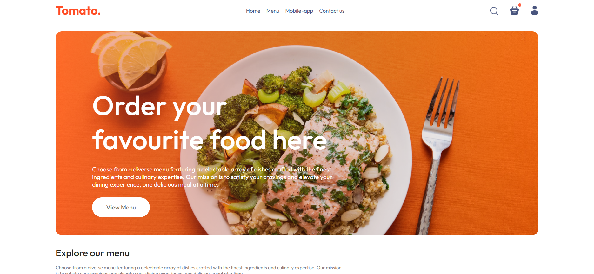
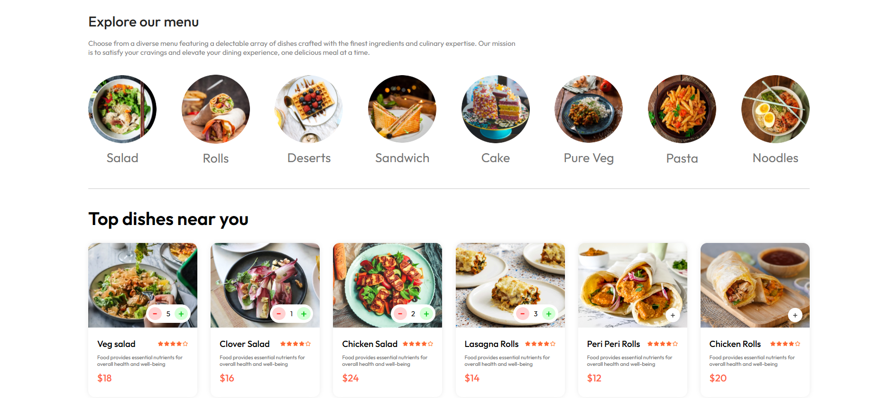
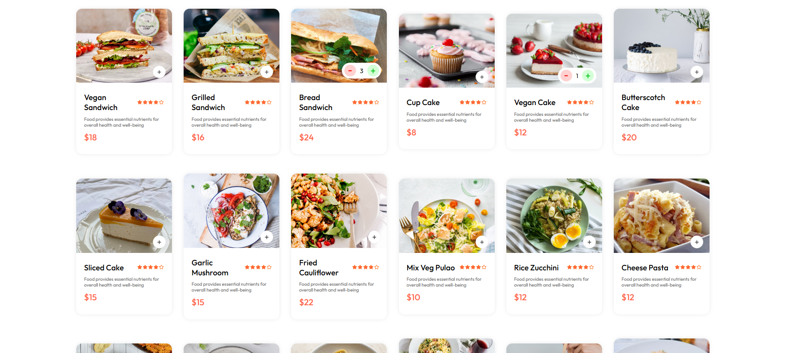
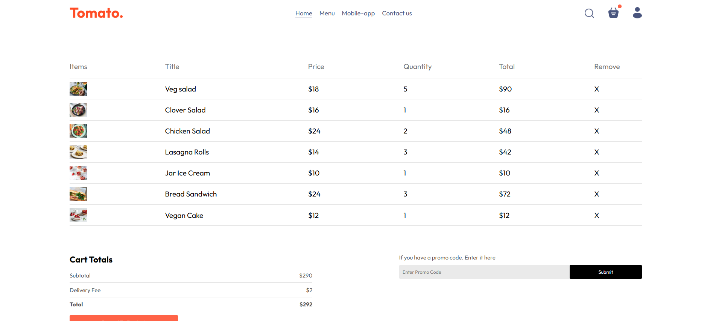
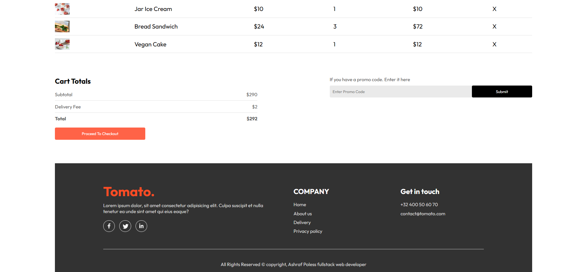
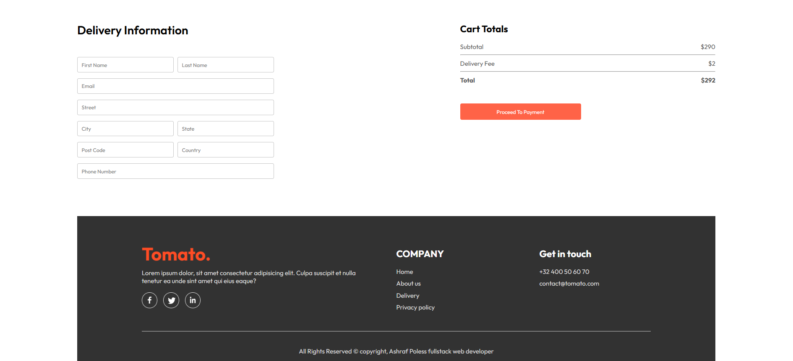
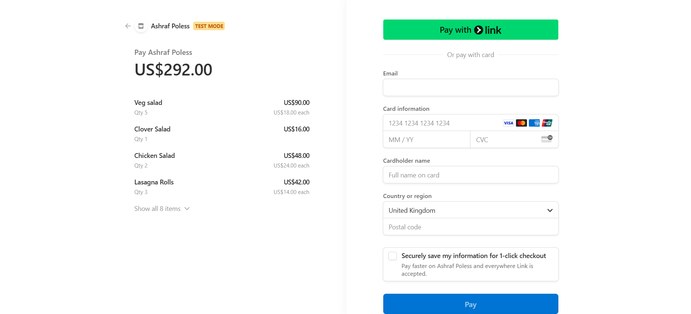

# Food Delivery Website - Frontend

## Contents

- [Food Delivery Website - Frontend](#food-delivery-website---frontend)
  - [Contents](#contents)
  - [Project Overview](#project-overview)
  - [Features](#features)
  - [Tech Stack](#tech-stack)
  - [Roadmap](#roadmap)
    - [Phase 1: UI/UX Implementation](#phase-1-uiux-implementation)
    - [Phase 2: API Integration](#phase-2-api-integration)
    - [Phase 3: Advanced Features](#phase-3-advanced-features)
    - [Phase 4: Optimization \& Deployment](#phase-4-optimization--deployment)
  - [Screenshots](#screenshots)
  - [NPM Libraries Used](#npm-libraries-used)
  - [Connect With Me](#connect-with-me)

## Project Overview

The frontend of the food delivery website provides users with an easy interface to browse menus, place orders, and manage their cart. It is built using React.js with a modern, responsive design.

## Features

- User Authentication: Sign-up, login, and authentication using JWT.

- Filtering: Users can filter menu items.

- Cart Management: Add, remove, and update items in the cart.

- Order Placement: Users can place orders and view order history.

- Payment Integration: Secure payment processing via Stripe.

- Responsive UI: Optimized for both desktop and mobile devices.

## Tech Stack

- Frontend Framework: React.js (Vite)

- State Management: Context, state management

- Routing: React Router

- API Communication: Axios

- Authentication: JWT (via backend)

- Version Control: Git, GitHub

## Roadmap

### Phase 1: UI/UX Implementation

- Design layout and navigation

- Implement product listing and cart functionality

### Phase 2: API Integration

- Connect frontend to backend endpoints

- Implement authentication & authorization

### Phase 3: Advanced Features

- Add payment integration

- Implement real-time order tracking (if applicable)

### Phase 4: Optimization & Deployment

- Performance improvements

- Deploy using Vercel

## Screenshots

## NPM Libraries Used

- react: Core library for building UI

- react-router-dom: Navigation and routing

- axios: API request handling

- react-toastify: Notifications and alerts

## Connect With Me

- [PORTFOLIO](ashrafpoless.vercel.app)
- [GITHUB](https://github.com/Ashrafpoless)
- [LINKEDIN](https://www.linkedin.com/in/ashraf-poless-034349317/)
